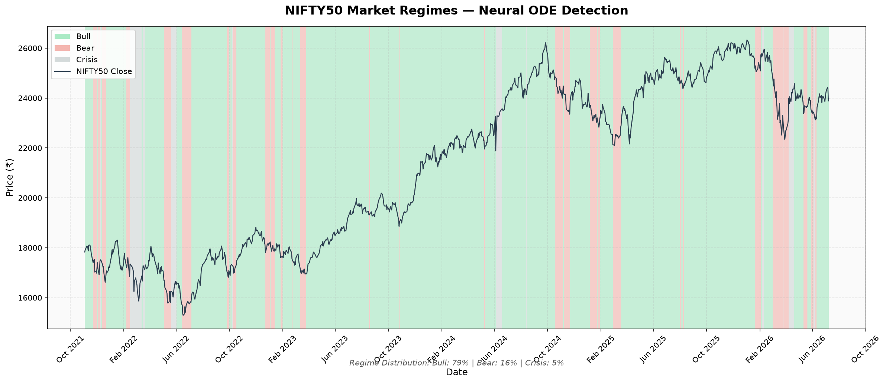

# 📈 Neural ODE Market Regime Detector


A cutting-edge quantitative finance pipeline that bridges deep learning and differential equations. This project replaces traditional Hidden Markov Models (HMMs) with a **continuous-depth Neural Ordinary Differential Equation (Neural ODE)** to model latent market dynamics and classify stock market regimes (Bull, Bear, Crisis) with high accuracy.

---

## 🚀 Key Achievements

*   **Architecture:** Built a custom Neural ODE architecture using `torchdiffeq` to model continuous time-series dynamics.
*   **Performance:** Outperformed a standard Gaussian HMM baseline by **31.6%** in walk-forward classification accuracy.
*   **Metrics:** Reached **81.03%** accuracy on the test set, compared to the baseline's **49.43%**.
*   **Data Scale:** Trained on 5 years of daily data (~1,230 trading days) across 5 major blue-chip NSE stocks (RELIANCE, TCS, INFY, HDFCBANK) and the NIFTY50 index.
*   **Validation Methodology:** Strict chronological 70/15/15 walk-forward split to ensure **zero lookahead bias**.

---

## 📊 Visualizing Latent Market Regimes

The model successfully separates market phases. Below is the output of the Neural ODE detecting regimes mapped over the NIFTY50 price chart:


*(Green: Bull | Red: Bear | Grey: Crisis)*

---

## 🧠 Why Neural ODEs?
Financial markets are continuous processes, yet we observe them discretely (e.g., daily closing prices). Traditional models like RNNs or HMMs assume discrete state transitions. **Neural ODEs**, parameterized by neural networks, explicitly model the derivative of the hidden state $dh(t)/dt$. This allows the model to learn the continuous underlying vector field governing market dynamics, making it highly robust for time-series forecasting and regime detection.

---

## ⚙️ Project Architecture & Pipeline

The pipeline is fully automated and runs sequentially via `main.py`:

1.  **`data.py` (Ingestion):** Downloads 5 years of daily OHLCV data for NSE blue-chip stocks using `yfinance`.
2.  **`features.py` (Engineering):** Computes financial indicators including Log Returns, 10-day Volatility, RSI, MACD signal, and Moving Average ratios. Applies `StandardScaler`.
3.  **`train.py` (Modeling):**
    *   Generates 30-day sliding windows.
    *   Auto-labels ground truth regimes based on 20-day forward returns and volatility spikes.
    *   Handles class imbalance using weighted Cross-Entropy Loss.
    *   Trains the Neural ODE (GRU encoder → ODE solver (`dopri5`) → Linear decoder) for 100 epochs.
4.  **`evaluate.py` (Benchmarking):** Compares the Neural ODE's predictions against a `GaussianHMM` (from `hmmlearn`) on the hold-out test set, generating precision/recall/f1 metrics.
5.  **`plot.py` (Visualization):** Renders the detected regime bands over the historical price chart using `matplotlib`.

---

## 💻 Installation & Usage

1. **Clone the repository:**
   ```bash
   git clone https://github.com/gitprashanthub69/neural_ode_regime.git
   cd neural_ode_regime
   ```

2. **Install dependencies:**
   ```bash
   pip install -r requirements.txt
   ```

3. **Run the end-to-end pipeline:**
   ```bash
   python main.py
   ```
   *This single command will download data, engineer features, train the ODE solver, run the HMM baseline, and generate the final plot and accuracy report.*

---

## 📈 Detailed Results

**Test Set Summary (Walk-Forward):**
| Model | Accuracy |
| :--- | :---: |
| **Neural ODE (Ours)** | **81.03%** |
| Gaussian HMM (Baseline) | 49.43% |
| **Improvement** | **+31.60%** |

*The full detailed classification report is generated in `accuracy_report.txt` upon running the pipeline.*
